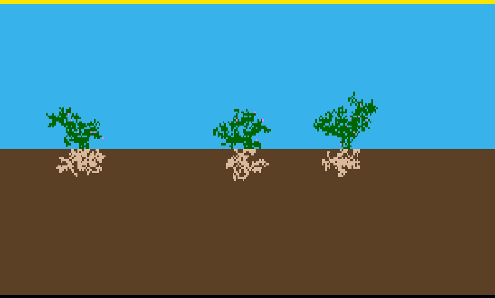

# Plants CA

A Plant Growth Cellular Automaton.

This is a [cellular automaton](https://en.wikipedia.org/wiki/Cellular_automaton) simulating plant growth, inspired by Biomaker CA[^1]. The app (`src/main.m`) provides a simple GUI wherein you can simulate many generations of plant growth, using various configurations, always getting a different result.

## Prerequisites

To install and use this app, you must have [GNU Octave (v10.2)](https://octave.org/download) installed. Full download instructions for each platform can be found on their [download page](https://octave.org/download).

## Installation

[Download](https://github.com/Dunc4nNT/plants-ca/releases) the latest release, and make sure to unzip the file if necessary. You can now open the folder in GNU Octave, open the `main.m` file under the `src` folder, and press `F5` to start the application. If prompted to change directory, please select confirm.

Alternatively, you can install the app through the CLI. To start, clone this [repository](https://github.com/Dunc4nNT/plants-ca), and change the current working directory to `plants-ca/src/`. You can now run the app by typing `./main.m` or `octave main.m`.

## Rules

This is a massively simplified version of the Biomaker CA[^1] ruleset. Plants CA includes nine [types of cells](#cell-types), and the concept of [energy](#energy). The world is a 2D grid, wherein each point (cell) has a unique type (such as leaf), and an amount of energy. Most cell types have a unique function that costs energy.

### Cell Types

The cell types are numbered by their internal number, which is also the number represented in exported worlds.

1. **Immovable** - This is an infinite source of energy, each generation sending energy upwards into the world. Generally speaking, this should be placed at the bottom of the world, the other cells do not interact with this cell type.
2. **Sun** - Similar to **Immovable**, except this sends energy downwards, and is generally placed at the top of the world.
3. **Earth** - Earth is a passage for energy, slowly passing energy upwards through its neighbouring cells.
4. **Air** - Similar to **Earth**, this cell type passes on energy, but downwards instead.
5. **Seed Below** - This seed turns into a **Root** once it has enough energy. This seed is meant to be placed "in" the earth, meaning it should have neighbouring earth cells below it.
6. **Root** - Initially created by a **Seed Below**, it can grow itself by replacing neighbouring earth once it has enough energy.
7. **Leaf** - Similar to **Root**, but this is created by **Seed Above**, and grows itself by replacing air cells. A leaf can also create a **Flower**, if the requirements are met.
8. **Flower** - This cell is created by a **Leaf**, and has only aesthetic value.
9. **Seed Above** - Similar to **Seed Below**, but this seed turns into a **Leaf**, and is meant to be placed "above" the earth, meaning it should have neighbouring air cells above it.

### Energy

Energy is represented as a number, and is required for any action, even if the action fails. These actions include: growing roots, leafs, or flowers, and turning seeds into a root or leaf. The cost of an action is deducted from all cells in the world of the type that did the action. This means that if one leaf creates another leaf, all leafs in the world lose some energy. If an action fails, half the normal cost is deducted.

Energy is generated by **Immovable** and **Sun**, which spread to neighbouring cells. Energy is then passed through the world from **Air** and **Earth**.

### Generations

Every generation, **Immovable**, **Sun**, **Earth**, and **Air** pass energy to their neighbouring cells that meet the requirements listed in [cell types](#cell-types). **Immovable** and **Sun** are infinite sources of energy, that produce energy for neighbouring cells every generation, while that of **Earth** and **Air** is limited to the amount they receive and pass to their neighbours.

If there is a **Seed Above** or **Seed Below** cell, they may turn into either **Leaf** or **Root**, respectively, as long as they meet te required energy.

**Root** cells are checked whether any have enough energy to grow, as well as enough neighbouring earth cells. If it is possible to grow, one cell is randomly selected, and then has a configurable probability to succeed growing. If the grow action succeeded, a nearby earth cell turns into **Root**, and energy is removed. **Leafs** have something similar happen, but they grow more **Leafs** instead, and use **Air** instead of **Earth**.

Finally, a single **Flower** may grow per generation. This can grow from any **Leaf** cell that meets the required neighbouring **Air**, as well as having enough energy. Like **Root** and **Leaf**, this also has a configurable probability of succeeding.

## Usage

There are various elements in the GUI that can be interacted with or display important information.

- **World** - The world is displayed in the center of the screen, and displays what each cell is.
  - **Yellow** - Sun
  - **Blue** - Air
  - **Black** - Immovable
  - **Brown** - Earth
  - **Light Brown** - Seed
  - **Green** - Leafs
  - **Light Brown** - Root
  - **Pink** - Flower
- **Generation** - The current generation.
- **Toggle Play** - Let the game automatically play through generations, or pause the simulation.
- **Speed Slider** - Adjust the speed at which the simulation is played.
- **Next Step** - Proceed to the next generation.
- **Reset World** - Resets the world back to an initial state.
- **Import World** - Import a custom world from a text (`*.csv`, or `*.txt`) file, or an image (`*.png`).
- **Export World** - Export the world as an image (`*.png`), or text (`*.csv`, or `*.txt`).
- **Wiki** - Get redirected to the [wiki](http://langers.nl/wiki/doku.php?id=biomaker_2025:welkom) page.
- **GitHub** - Get redirected to the [GitHub repository](https://github.com/Dunc4nNT/plants-ca) page.

### Settings

Aside from the buttons described above, there are also many numbers that can be configured. These numbers, beside the initial world itself, have great impact on the growth of a plant.

- **Default Energy** - The initial energy a cell type starts with.
- **Energy Required for Plant** - The energy a seed is required to have before turning into either a root, or a leaf.
- **Energy Required to Grow** - The energy required for the selected type to be created. Exceptions to this option are the initial leaf and root grown from a seed.
- **New Cell Energy** - The energy a newly grown cell starts with.
- **Amount of Neighbours** - The amount of neighbours required for the selected type to be created. For leafs and flowers, this is air, and for roots, this is earth.
- **Growth Probability** - The probability a cell of this type grows in a generation. Note that a cell has to exist that meets the energy and neighbour requirements.

## Configurations

There are many possible configurations, some highlighted ones can be found below.

**"Normal World"**

This world configuration is the default set by the app, having a sun covering the entire top part of the world, and immovable the bottom. Three seeds are planted in locations relatively far away from one another, leading to all plants being able to grow well for many generations and still stay separated.

## Contact

If you are experiencing bugs, feel free to open an [issue](https://github.com/Dunc4nNT/plants-ca/issues).

## Licensing

This repository is licensed under the Mozilla Public License 2.0 (MPL 2.0). See [LICENSE](./LICENSE) for more information.

[^1]: E. Randazzo and A. Mordvintsev, “Biomaker CA: a Biome Maker project using Cellular Automata,” arXiv.org, Jul. 18, 2023. https://arxiv.org/abs/2307.09320
